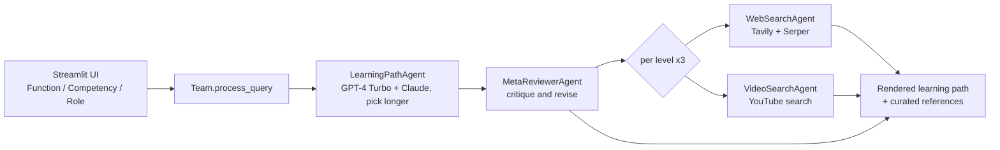

# Competency Builder

A Streamlit application that generates a three-level (Beginner / Intermediate / Advanced) learning path for a chosen business function, competency, and role, then attaches curated web and video references for each level.

The user selects — or uploads an Excel mapping of — Function → Competency → Role. The app prompts two LLM providers for a structured learning path, runs a critic pass over the draft, and gathers per-level references via web search (Tavily, Serper) and YouTube search. Output is rendered as Markdown tables with links, alongside generation latency and the winning provider. Intended for L&D and HR practitioners building role-specific development plans.

## Architecture at a glance

- **Orchestration pattern:** single-process **sequential pipeline with a generator–critic pair**. A `Team` class runs `LearningPathAgent` (generator) → `MetaReviewerAgent` (critic), then loops over the three levels gathering references. Nothing runs in parallel; each provider and each search call executes in sequence.
- **Models:** OpenAI `gpt-4-turbo` and Anthropic `claude-3-5-sonnet-20241022`, both called for every generation; the longer response wins (a length heuristic, not a scored judge). The critic's revision replaces the draft only if it is at least 80% of the draft's length.
- **Framework:** a custom ~30-line agent framework defined in the same file (`Agent` base class, `Team` orchestrator, `Memory` list) — no LangChain/LangGraph at runtime, despite their presence in `requirements.txt`.
- **Memory / session state:** an in-process `Memory` list scoped to a `Team` instance that is recreated on every button click (effectively request-scoped), plus Streamlit `st.session_state` for the current result. No persistence.
- **Retrieval:** live search-API calls (Tavily + Google Serper for web, `youtube_search` for videos). No vector store, no embeddings, no RAG.



## Quickstart

```bash
git clone https://github.com/git-bonda108/competency-builder.git
cd competency-builder

python -m venv .venv && source .venv/bin/activate
pip install -r requirements.txt
pip install openpyxl   # needed for Excel upload; not listed in requirements.txt

cp .env.example .env   # then fill in the four API keys

streamlit run competancy-matrix.py
```

Expected output: Streamlit prints `Local URL: http://localhost:8501`; the page shows the Function/Competency/Role selectors. Click **Generate Learning Path** and, after the spinner completes (two LLM calls plus six search calls, sequential), the left pane shows the Markdown learning path and the right pane shows per-level web and video references.

Optionally upload an `.xlsx` in the sidebar with columns named exactly `Function`, `Competency`, `Role` to drive the dropdowns; without one, the app falls back to a default function list and free-text inputs.

> Note: `requirements.txt` contains many packages the app never imports (LangChain, LangGraph, pandasai, chromadb, pinecone, …). The actual runtime imports are `streamlit`, `pandas`, `openai`, `anthropic`, `tavily-python`, `youtube_search`, `requests`, `python-dotenv` (plus `openpyxl` for Excel). See [docs/HARDENING.md](docs/HARDENING.md).

## Configuration

All keys are read from the environment (a `.env` file is loaded via `python-dotenv`). No key has a default; a missing key surfaces as an API error at generation time.

| Variable | What it is | Where to get it |
|---|---|---|
| `OPENAI_API_KEY` | OpenAI API key (GPT-4 Turbo access) | platform.openai.com |
| `ANTHROPIC_API_KEY` | Anthropic API key (Claude 3.5 Sonnet access) | console.anthropic.com |
| `TAVILY_API_KEY` | Tavily web-search API key | tavily.com |
| `SERPER_API_KEY` | Google Serper search API key | serper.dev |

Model IDs, `max_tokens`, and temperature are hard-coded in `competancy-matrix.py`; there are no model-selection env vars.

## Documentation

- [docs/ARCHITECTURE.md](docs/ARCHITECTURE.md) — component map, data flow, orchestration analysis, state, trade-offs
- [docs/EVALUATION.md](docs/EVALUATION.md) — current test reality and a proposed evaluation harness
- [docs/HARDENING.md](docs/HARDENING.md) — security posture and a staged path to production
